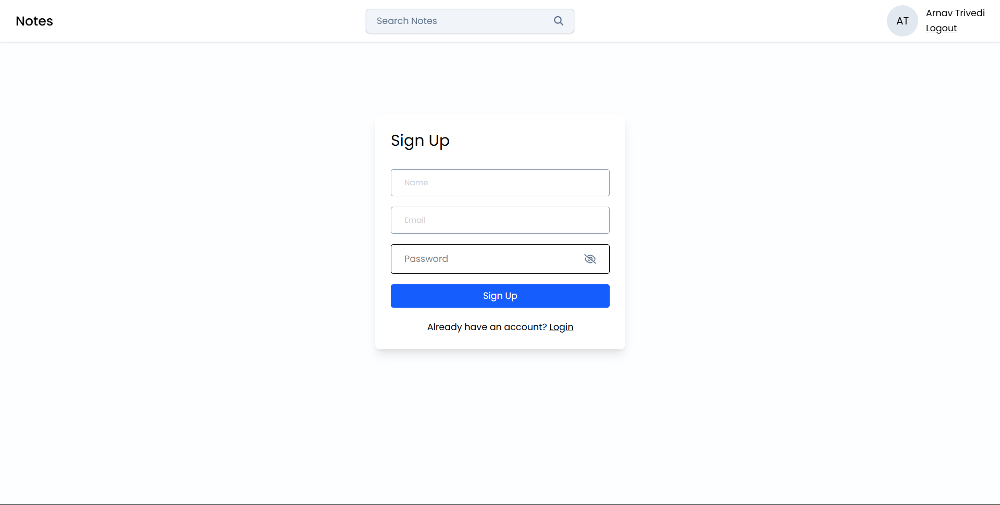
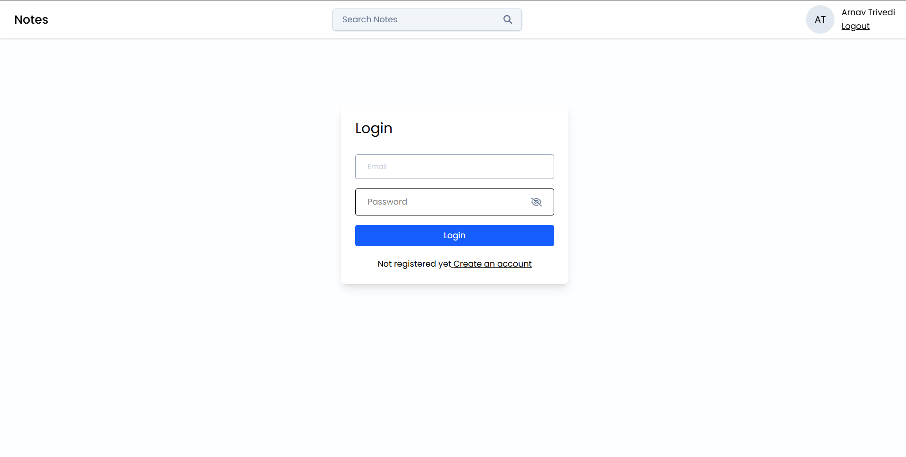
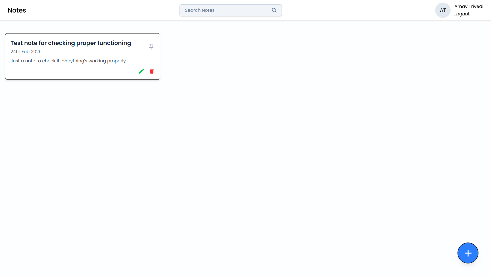
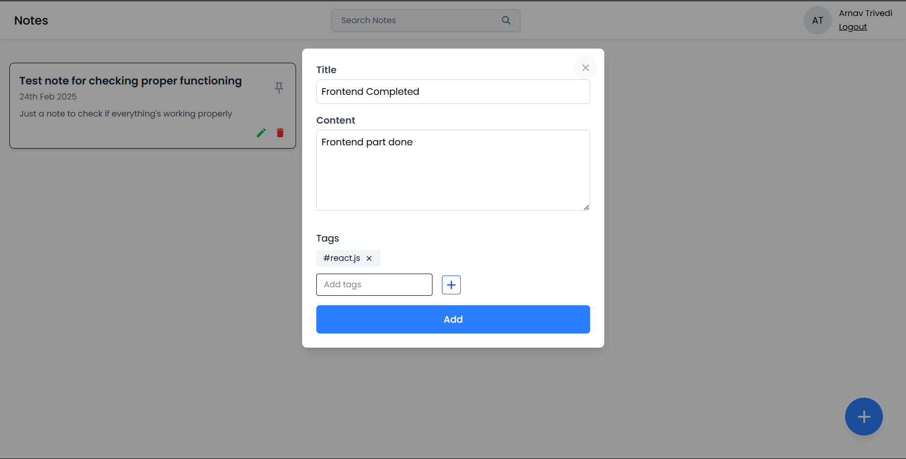

# Notes App - Frontend

## Screenshots

### Sign-up Page


### Login Page


### Dashboard


### Create Note Page


## Installation
```sh
npm install
npm start

Although i would recommend the use of bun instead of node package manager.
Just a suggestion
```